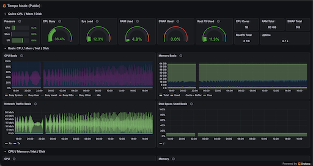
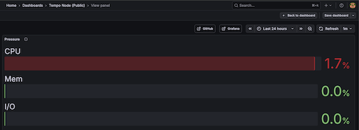
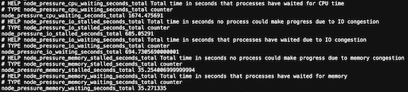

<p align="center">
  
  
  
  
  
  
</p>

# 🚀 Tempo Node Setup Guide (Moderato Testnet)

This guide will walk you through setting up a **Tempo full node** on a Linux VPS using the **Moderato testnet** (launched Jan 8).

## 📚 Table of Contents

- [System Requirements](#-system-requirements)
- [1) Disable Cloud-Init Network Overrides](#-1-disable-cloud-init-network-overrides)
- [2) Configure Netplan DNS](#-2-configure-netplan-dns)
- [3) Install System Dependencies](#-3-install-system-dependencies)
- [4) Install Rust](#-4-install-rust)
- [5) Install Tempo](#-5-install-tempo)
- [6) Generate Validator Keys](#-6-generate-validator-keys)
- [7) Start Screen Session](#-7-start-screen-session)
- [8) Download Chain Snapshot](#-8-download-chain-snapshot)
- [9) Start the Node](#-9-start-the-node)
- [Detach Screen](#-detach-screen-leave-node-running)
- [Check Sync Status](#-check-sync-status)
- [Confirm Network](#-confirm-network)
- [Check Peer Count](#-check-peer-count)
- [Done](#-done)
- [Systemd Auto-Start Service (Optional)](#-systemd-auto-start-service-optional)

---

## ⚡ One-Click Install (Recommended)

This installs **Tempo + dependencies + snapshot + auto-restart systemd service** in one command.

```bash
git clone https://github.com/JackTheGit/tempo-node-setup.git
cd tempo-node-setup

# GitHub may not preserve executable permissions
chmod +x install.sh

# Replace with your wallet address
FEE_RECIPIENT=0xYourWalletHere sudo -E bash install.sh
```

### After install

Check logs:

```bash
sudo journalctl -u tempo -f
```

Check service:

```bash
sudo systemctl status tempo --no-pager
```

Stop / start:

```bash
sudo systemctl stop tempo
sudo systemctl start tempo
```

---


## 🧰 System Requirements


| Component | Minimum    | Recommended |
| --------- | ---------- | ----------- |
| CPU       | 8 cores    | 16+ cores   |
| RAM       | 16 GB      | 32 GB       |
| Storage   | 250 GB SSD | 500 GB NVMe |
| Network   | 500 Mbps   | 1 Gbps      |

---

## 🌐 1) Disable Cloud-Init Network Overrides


```bash
sudo mkdir -p /etc/cloud/cloud.cfg.d
echo "network: {config: disabled}" | sudo tee /etc/cloud/cloud.cfg.d/99-disable-network-config.cfg
```

---

## 🧩 2) Configure Netplan DNS


```bash
sudo nano /etc/netplan/50-cloud-init.yaml
```

Add:

```yaml
nameservers:
  addresses:
    - 1.1.1.1
    - 8.8.8.8
```

Apply:

```bash
sudo netplan apply
```

---

## 📦 3) Install System Dependencies


```bash
sudo apt update && sudo apt -y upgrade
sudo apt install -y curl screen iptables build-essential git wget lz4 jq make gcc nano openssl \
automake autoconf htop nvme-cli pkg-config libssl-dev libleveldb-dev \
tar clang bsdmainutils ncdu unzip ca-certificates net-tools iputils-ping
```

---

## 🦀 4) Install Rust

```bash
curl --proto '=https' --tlsv1.2 -sSf https://sh.rustup.rs | sh
source $HOME/.cargo/env
```

---

## ⚙️ 5) Install Tempo


```bash
cargo install --git https://github.com/tempoxyz/tempo.git tempo --root /usr/local --force
export PATH=/usr/local/bin:$PATH
hash -r
which tempo
```

---

## 🔑 6) Generate Validator Keys


```bash
mkdir -p $HOME/tempo/keys

tempo consensus generate-private-key --output $HOME/tempo/keys/signing.key
tempo consensus calculate-public-key --private-key $HOME/tempo/keys/signing.key
```

---

## 🖥️ 7) Start Screen Session

```bash
screen -S tempo
```

---

## 📥 8) Download Chain Snapshot


```bash
mkdir -p $HOME/tempo/data
tempo download --datadir /root/tempo/data
```

---

## 🚀 9) Start the Node


Replace `YOUR_WALLET_HERE` with your Ethereum address:

```bash
tempo node --datadir /root/tempo/data \
  --chain testnet \
  --port 30303 \
  --discovery.addr 0.0.0.0 \
  --discovery.port 30303 \
  --consensus.signing-key /root/tempo/keys/signing.key \
  --consensus.fee-recipient YOUR_WALLET_HERE
```

---

## 🧲 Detach Screen (leave node running)

```
Ctrl + A then D
```

Reconnect later:

```bash
screen -r tempo
```

---

## 🔍 Check Sync Status

```bash
curl -s http://127.0.0.1:8545 \
  -H "Content-Type: application/json" \
  -d '{"jsonrpc":"2.0","method":"eth_syncing","params":[],"id":1}'
```

Fully synced:

```json
{"result":false}
```

---

## 🌐 Confirm Network

```bash
curl -s http://127.0.0.1:8545 \
  -H "Content-Type: application/json" \
  -d '{"jsonrpc":"2.0","method":"eth_chainId","params":[],"id":1}'
```

Moderato:

```
0xa5bf
```

---

## 🔌 Check Peer Count

```bash
curl -s http://127.0.0.1:8545 \
  -H "Content-Type: application/json" \
  -d '{"jsonrpc":"2.0","method":"net_peerCount","params":[],"id":1}'
```

Example:

```
0x12  (18 peers)
```

---

## 🎉 Done

Your Tempo node is now:

* On **Moderato testnet**
* Fully synced
* Serving RPC
* Connected to consensus 🚀


# 📊 Tempo Node Monitoring (Grafana + Prometheus + PSI)

Tempo nodes must stay responsive under sustained disk and network load.
Traditional CPU and RAM charts are **not enough** — Linux can be *stalled* even when CPU is idle.

This guide enables **Linux PSI (Pressure Stall Information)** so you can see:

* CPU scheduling pressure
* Memory reclaim pressure
* Disk I/O stalls

All in **real-time** via Grafana.

---

## What You Get

You will get a live dashboard showing:

| Metric              | What it means                      |
| ------------------- | ---------------------------------- |
| CPU Busy            | Actual CPU usage                   |
| RAM Used            | Real memory consumption            |
| Disk Used           | Root filesystem usage              |
| **CPU Pressure**    | Time CPU tasks were stalled        |
| **Memory Pressure** | Time memory allocation was blocked |
| **I/O Pressure**    | Time disk I/O was blocked          |

This lets you detect **node starvation** before it causes missed blocks or degraded rewards.

---

## Step 1 — Enable Linux PSI on the Host

PSI is available on all modern Linux kernels but must be exposed.

Verify PSI exists:

```bash
ls /proc/pressure
```

You should see:

```
cpu
io
memory
```

If not, your kernel is too old.

---

## Step 2 — Run Node Exporter With PSI Support

We must give Node Exporter access to the **host kernel**.

Run Node Exporter like this:

```bash
docker rm -f node-exporter || true

docker run -d --name node-exporter \
  --restart=always \
  --net=host \
  --pid=host \
  -v "/:/host:ro,rslave" \
  prom/node-exporter:latest \
  --path.rootfs=/host \
  --path.procfs=/host/proc \
  --path.sysfs=/host/sys
```

Verify PSI is being exported:

```bash
curl -s http://127.0.0.1:9100/metrics | grep node_pressure
```

You should see:

```
node_pressure_cpu_waiting_seconds_total
node_pressure_io_waiting_seconds_total
node_pressure_memory_waiting_seconds_total
```

> ⚠️ Node Exporter is read-only (`:ro`) and does **not** modify your system — it only exposes metrics.

---

## Step 3 — Prometheus Config

Ensure Prometheus scrapes Node Exporter:

```yaml
scrape_configs:
  - job_name: "node"
    static_configs:
      - targets: ["127.0.0.1:9100"]
```

Restart Prometheus if needed.

---

## Step 4 — Import the Dashboard

Import this dashboard into Grafana:

**Dashboard ID:** `1860`
or
Use the **Node Exporter Full** dashboard and then add PSI panels.

---

## Step 5 — Pressure (PSI) Queries

Add a **Bar Gauge** panel named **Pressure** with these queries:

### CPU Pressure

```promql
100 * sum(irate(node_pressure_cpu_waiting_seconds_total[5m]))
```

Legend:

```
CPU
```

---

### Memory Pressure

```promql
100 * sum(irate(node_pressure_memory_waiting_seconds_total[5m]))
```

Legend:

```
Mem
```

---

### I/O Pressure

```promql
100 * sum(irate(node_pressure_io_waiting_seconds_total[5m]))
```

Legend:

```
I/O
```

## Live Tempo Node Dashboard



This dashboard shows real-time CPU, memory, disk and kernel pressure.

## Linux Pressure Stall Information (PSI)



PSI measures how long Linux tasks are stalled waiting for CPU, memory or disk.

## Verifying PSI Export



These counters come directly from `/proc/pressure/*` in the Linux kernel and prove PSI is active on the host.

> If CPU Pressure > 5% or I/O Pressure > 10% for extended periods, your node will start missing blocks.

---

## How To Set Legends

For each query:

1. Click **Legend**
2. Select **Custom**
3. Enter:

   * `CPU`
   * `Mem`
   * `I/O`

This ensures they appear cleanly instead of `Value`.

---

## Example — Live Public Dashboard

This Tempo node is publicly monitored using PSI:

👉 **[https://grafana.slotsdroid.com/public-dashboards/27433cfd8c71408babb8842e143ac55f](https://grafana.slotsdroid.com/public-dashboards/27433cfd8c71408babb8842e143ac55f)**

It shows:

* CPU, memory, disk
* Live network traffic
* **Kernel-level stall pressure**

---

## Why PSI Matters For Tempo

Your node can fail even when:

* CPU looks low
* RAM looks free

But PSI shows when:

* Disk is saturated
* Kernel is blocking
* Processes are waiting

This is exactly what causes:

* Missed attestations
* Slow gossip
* Lost rewards

PSI = **early warning system**

---

## You Are Now Running a Professional-Grade Node

Most nodes run blind.

You now see **what the kernel sees** — and that’s how you keep a Tempo node healthy under load 🚀

