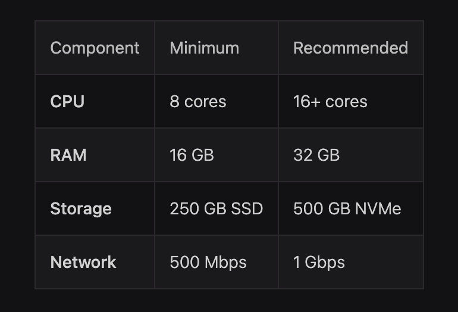
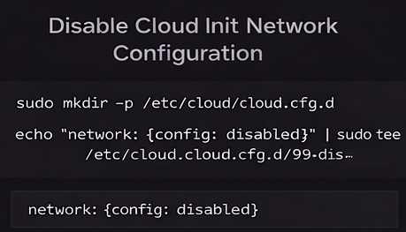
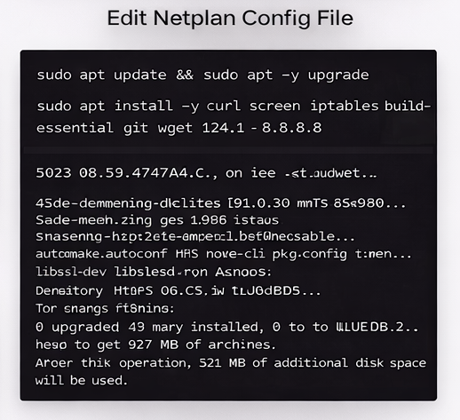
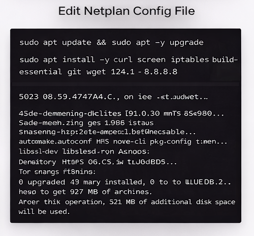
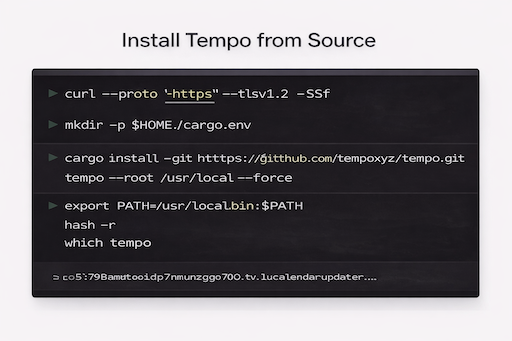
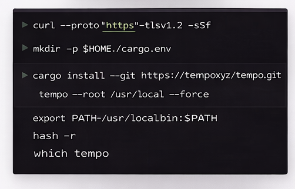
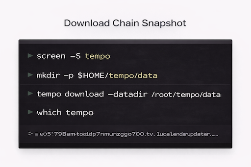
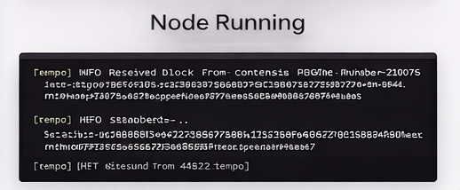

<p align="center">
  
  
  
  
  
</p>

# 🚀 Tempo Node Setup Guide (Moderato Testnet)

This guide will walk you through setting up a **Tempo full node** on a Linux VPS using the **Moderato testnet** (launched Jan 8).

---

## 🧰 System Requirements



| Component | Minimum    | Recommended |
| --------- | ---------- | ----------- |
| CPU       | 8 cores    | 16+ cores   |
| RAM       | 16 GB      | 32 GB       |
| Storage   | 250 GB SSD | 500 GB NVMe |
| Network   | 500 Mbps   | 1 Gbps      |

---

## 🌐 1) Disable Cloud-Init Network Overrides



```bash
sudo mkdir -p /etc/cloud/cloud.cfg.d
echo "network: {config: disabled}" | sudo tee /etc/cloud/cloud.cfg.d/99-disable-network-config.cfg
```

---

## 🧩 2) Configure Netplan DNS



```bash
sudo nano /etc/netplan/50-cloud-init.yaml
```

Add:

```yaml
nameservers:
  addresses:
    - 1.1.1.1
    - 8.8.8.8
```

Apply:

```bash
sudo netplan apply
```

---

## 📦 3) Install System Dependencies



```bash
sudo apt update && sudo apt -y upgrade
sudo apt install -y curl screen iptables build-essential git wget lz4 jq make gcc nano openssl \
automake autoconf htop nvme-cli pkg-config libssl-dev libleveldb-dev \
tar clang bsdmainutils ncdu unzip ca-certificates net-tools iputils-ping
```

---

## 🦀 4) Install Rust

```bash
curl --proto '=https' --tlsv1.2 -sSf https://sh.rustup.rs | sh
source $HOME/.cargo/env
```

---

## ⚙️ 5) Install Tempo



```bash
cargo install --git https://github.com/tempoxyz/tempo.git tempo --root /usr/local --force
export PATH=/usr/local/bin:$PATH
hash -r
which tempo
```

---

## 🔑 6) Generate Validator Keys



```bash
mkdir -p $HOME/tempo/keys

tempo consensus generate-private-key --output $HOME/tempo/keys/signing.key
tempo consensus calculate-public-key --private-key $HOME/tempo/keys/signing.key
```

---

## 🖥️ 7) Start Screen Session

```bash
screen -S tempo
```

---

## 📥 8) Download Chain Snapshot



```bash
mkdir -p $HOME/tempo/data
tempo download --datadir /root/tempo/data
```

---

## 🚀 9) Start the Node



Replace `YOUR_WALLET_HERE` with your Ethereum address:

```bash
tempo node --datadir /root/tempo/data \
  --chain testnet \
  --port 30303 \
  --discovery.addr 0.0.0.0 \
  --discovery.port 30303 \
  --consensus.signing-key /root/tempo/keys/signing.key \
  --consensus.fee-recipient YOUR_WALLET_HERE
```

---

## 🧲 Detach Screen (leave node running)

```
Ctrl + A then D
```

Reconnect later:

```bash
screen -r tempo
```

---

## 🔍 Check Sync Status

```bash
curl -s http://127.0.0.1:8545 \
  -H "Content-Type: application/json" \
  -d '{"jsonrpc":"2.0","method":"eth_syncing","params":[],"id":1}'
```

Fully synced:

```json
{"result":false}
```

---

## 🌐 Confirm Network

```bash
curl -s http://127.0.0.1:8545 \
  -H "Content-Type: application/json" \
  -d '{"jsonrpc":"2.0","method":"eth_chainId","params":[],"id":1}'
```

Moderato:

```
0xa5bf
```

---

## 🔌 Check Peer Count

```bash
curl -s http://127.0.0.1:8545 \
  -H "Content-Type: application/json" \
  -d '{"jsonrpc":"2.0","method":"net_peerCount","params":[],"id":1}'
```

Example:

```
0x12  (18 peers)
```

---

## 🎉 Done

Your Tempo node is now:

* On **Moderato testnet**
* Fully synced
* Serving RPC
* Connected to consensus 🚀
